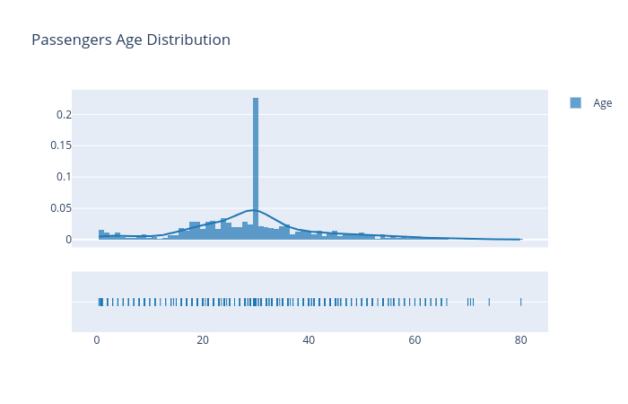
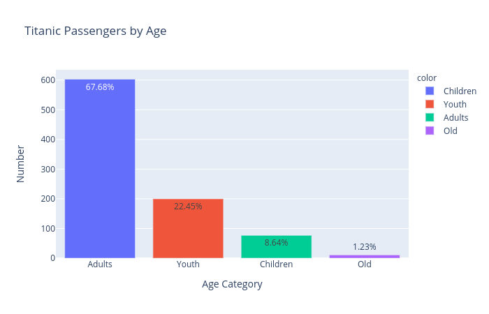
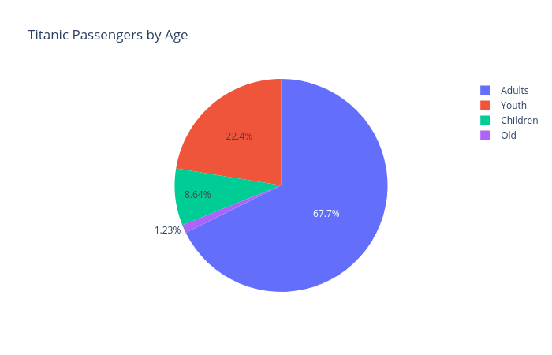
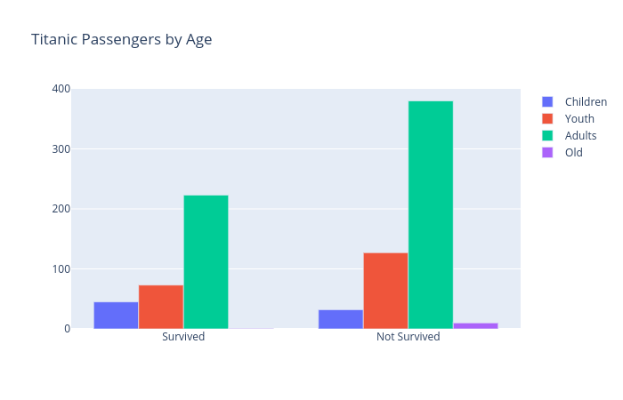
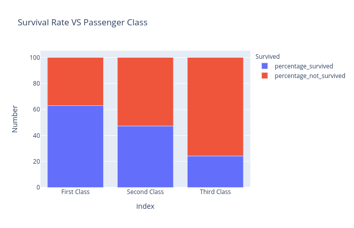
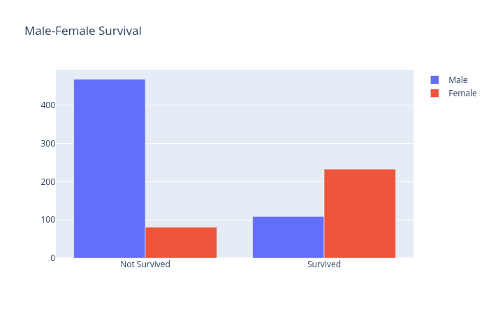

Titanic Dataset Analysis and Visualization with Python
-------------
##### Python Version Used : 3.8
##### Libraries Used:
- pandas: 1.1.3
- plotly: 4.14.3

##### Flutter Version Used : 1.22.4  
##### Dataset from : [Kaggle](https://www.kaggle.com/c/titanic/data)  

-------------  

## Screenshots  

   
  
   
  
  
    

